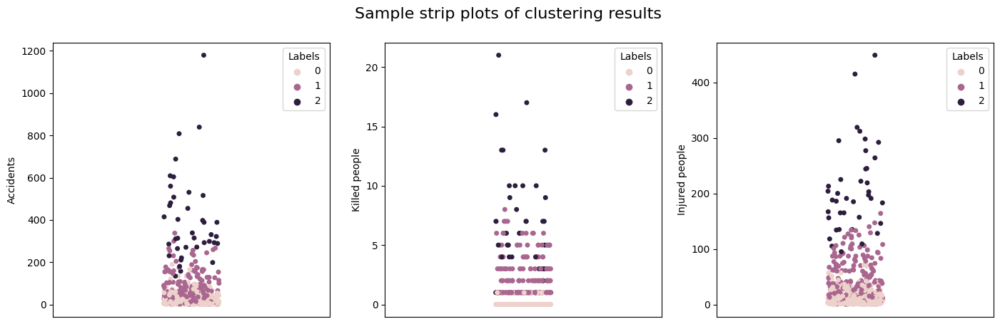

# accidents_smb

The following description corresponds to the **Data pipeline**, **Clustering** and **Motorcycles and other vehicles** modules of this project. Among the many tasks the Secretary of Mobility of Bogotá (SMB) does, they implement road safety operations aiming at reducing accidents, especially from motorcyclists given their higher accident risk. Currently, the locations where such operations are implemented are determined manually crossing information from several Excel files. The clustering module pulls information on accidents and the city's road grid to find highway corridors with different priority levels for implementing road safety operations.

The main challenge for developing this project is the lack of 'useful' information on highway corridors. The road grid available has either too long or too short corridors, which does not allow to locate sections of the corridors to focus on for implementing road safety operations. A future implementation should relate different geographical sources to locate each accident on shorter corridors within the long main corridors from the available road grid file.

Another challenge was the initial ETL process to pull accident data from 2015 to Aug 2022 from an ArcGIS service with data from all the accidents reported in the city and populate a local postgres database with such data. The folder **initial_etl** contains the Jupyter notebooks that allowed to retrieve such data and populate the database. Once the data was pulled, it was organized in several JSON files that were later used to populate the database.

## Getting started

While the initial ETL process could have been automatized for the ArcGIS layers *Siniestro*, *Con Herido* and *Con Muerto*, the lack of date information in the remaining layers (*Actor Vial*, *Causa* and *Vehiculo*) and the impossibility of executing JOIN operations in the service make difficult to automatize such process for these layers. Instead, the process was done using the OBJECTID field of these layers in a somewhat manual process.

Please check the Jupyter notebooks inside the folder **initial_etl** to see how the initial ETL process was done. Please also check the Jupyter notebook `4_database_creation.ipynb` before creating the local postgres database. Make sure to create the database beforehand and adjust the database connection parameters in the notebook accordingly.

Note the layer *Via* is not considered since it is outdated.

The ArcGIS service can be found in [Accidentalidad/WSAcidentalidad_Publico (FeatureServer)](https://sig.simur.gov.co/arcgis/rest/services/Accidentalidad/WSAcidentalidad_Publico/FeatureServer).

## Data model

The data model created through the initial ETL process and its documentation can be found in the folder **data_model**.

## Data pipeline

While testing this module, errors related to the connection with the ArcGIS service ocurred several times. This module provides a Jupyter notebook instead of a Python script to update the local postgres database in a safe way.

### Using the notebook

Before running the notebook, please make sure to create the database and adjust the database connection parameters in the notebook accordingly.

The notebook of this module, `data_pipeline.ipynb`, is stored in the folder **data_pipeline**. The notebook places you in the current year and month to update the database with data from the previous month. Given the time it takes for the Secretary of Mobility of Bogotá to update the ArcGIS service, we suggest to run the notebook halfway through the month.

The notebook automatically retrieves the current year and month and uses this information to update the tables *siniestros* (accidents), *conheridos* (injured people) and *confallecidos* (killed people) since the corresponding ArcGIS layers store year and month information.

The notebook then retrieves the *FORMULARIO* values from the recently retrieved accidents data and uses these values to run queries in the remaining layers, pulling records whose *FORMULARIO* values match them. Once the records are pulled, they are used to update the tables *actores* (actors), *causas* (causes) and *vehiculos* (vehicles).

## Clustering

### Using the scripts

The main scripts of this module are `model_creation.py` and `model_prediction.py`. These are stored in the folder **clustering**. Before running any of the scripts, please unrar the .rar file in the folder **clustering** and read the following sections.

#### model_creation.py

Before running the script, please make sure to create the database and adjust the database connection parameters in the supporting functions accordingly.

This script uses functions from `data_creation.py` to pull 3-year data on accidents from the local postgres database and then fits the K-Prototypes clustering algorithm to such data using 3 clusters. The engineered dataset has the following form: 

| Time of day       | Accidents | Killed people | Injured people    | Vulnerable actors |
| ---               | ---       | ---           | ---               | ---               |
| Morning 5-8       | ####      | ####          | ####              | ####              |
| Afternoon 12-18   | ####      | ####          | ####              | ####              |

Each row shows 3-year information for a specific highway corridor during a specific time of the day. The information corresponds to number of accidents, number of killed people, number of injured people and a categorical variable that indicates whether there were no vulnerable road actors killed or injured (0) or injured vulnerable road actors but none killed (1) or killed vulnerable road actors (2). The name of the highway corridor is removed before performing the clustering. 

The script saves the MinMaxScaler and K-Prototypes parameters in separate files that are later loaded by `model_prediction.py`. The files are named **scaler.mod** and **kprototypes.mod**, respectively.

The user can change the arguments of the function `data_for_clustering(2021, 12, 31)` to bring data for a specific 3-year period. Once they are modified, the user can run the script and it will automatically pull the 3-year data up to the modified date and fit the K-Prototypes algorithm. To run this script, open a terminal and run:

```
python model_creation.py
```

The clusters should be updated with certain periodicity. **Every time this script is run to update the clusters, the user should manually inspect the results to properly label the data in `model_prediction.py`**. The Jupyter notebook `model_creation.ipynb` provides code that plots several strip plots that can help in such inspection. Figure 1 below shows three sample strip plots, from left to right: number of accidents, number of killed people in accidents and number of injured people in accidents. These plots suggest the blue labels (0) correspond to corridors and times of the day with the highest accident, killed people and injured people risks, the orange labels (1) to corridors and times of the day with lower risks and the green labels (2) to corridors and times of the day with the lowest risks. 

<p style="line-height:0.5" align="center">
    
</p>
<p style="line-height:0.5" align="center"><b>Figure 1.</b> Strip plots generated with data from Sep 2019 to Sep 2022.</p>

The results of this inspection must be implemented in a dictionary, which is explained in the following section.

Ultimately, the clusters indicate a 3-level priority scheme: (i) corridors that should be prioritized for road safety operations, (ii) complementary corridors on which road safety operations could be implemented and (iii) remaining corridors. While this could arguably be the ultimate purpose of this module (i.e., the SMB could already use the clusters generated by this script to prioritize corridors for road safety operations), these clusters are used in `model_prediction.py` to predict the clusters for more recent 3-year data and prioritize corridors for road safety operations based on these predicted clusters.

#### model_prediction.py

This script loads the following information:

* The MixManScaler parameters used to scale the data feeded to the K-Prototypes algorithm, which are contained in **scaler.mod**.
* The resulting K-Prototypes parameters, which are contained in **kprototypes.mod**.

The user can change the arguments of the function `data_for_clustering(2022, 3, 31)` to bring data for a specific 3-year period. Once they are modified, the user can run the script and it will automatically pull the 3-year data up to the modified date and predict its priority clusters. 

Before running this script, the user needs to inspect the clustering results from `model_creation.py` and modify the dictionary in the following line of code from `model_prediction.py` accordingly:

```
dictp = {0: "1 Priorizado", 1: "3 NA", 2: "2 Complementario"}
```

The line of code above assumes the label **0** generated by `model_creation.py` represents the corridors with the highest priority, label **2** the complementary corridors and label **1** the remaining corridors.

After inspecting the labels and implementing the necessary changes to the dictionary, the user can run the script to generate the file **prioritized_corridors.csv**, which will contain the corridors with their predicted priority levels. The SMB should load this file to the Power BI dashboard they were provided with. To run this script, open a terminal and run:

```
python model_prediction.py
``` 

The results from a clustering performed with data from Sep 2019 to Sep 2022 and predictions made for data from Dic 2019 to Dic 2022 looks like the following:

| Highway corridor  | Time of day       | Accidents | Killed people | Injured people    | Vulnerable actors | Priority      | 
| ---               | ---               | ---       | ---           | ---               | ---               | ---           |
| Av Boyacá         | Night 22-2        | 284       | 24            | 249               | 2                 | 1 Prioritized |
| Av Caracas        | Afternoon 12-18   | 507       | 15            | 427               | 2                 | 1 Prioritized |

This module is already provided with files that allow to run a test. These files are:

* **scaler_r.mod:** contains the MinMaxScaler parameters used when scaling the continuous features before fitting the clustering model.
* **kprototypes_r.mod:** contains the K-Prototypes model fitted with 3-year data from 2019 to 2021.
* **raw_data_predict_r.csv:** contains 3-year data up to March 31, 2022.

The test will predict the priority levels for the 3-year data from **raw_data_predict_r.csv**. It requires to run only `model_prediction.py` commenting line 12, uncommenting line 14 and changing the names of the scaler and model files in lines 17 and 18, respectively, by appending *_r* to them:

Line 12
```
cluster_df = data_for_clustering(2022, 3, 31)
```
```
#cluster_df = data_for_clustering(2022, 3, 31)
```

Line 14
```
#cluster_df = pd.read_csv("raw_data_predict_r.csv")
```
```
cluster_df = pd.read_csv("raw_data_predict_r.csv")
```

Line 17
```
scaler = joblib.load("scaler.mod")
```
```
scaler = joblib.load("scaler_r.mod")
```

Line 18
```
clusterer = joblib.load("kprototypes.mod")
```
```
clusterer = joblib.load("kprototypes_r.mod")
```

Before running the test, please make sure to create the database and adjust the database connection parameters in the supporting functions accordingly.

The folder **clustering** provides Jupyter notebooks for data creation, model creation and model prediction to play with the implementation of this module.

## Motorcycles and other vehicles

### Using the script

Before running the script, please make sure to create the database and adjust the database connection parameters in the script accordingly.

The main script of this module is `crosstab_heatmaps.py`. This is stored in the folder **motorcycle_accidents**. This folder also provides the corresponding Jupyter notebook to play with the implementation of this module.

The script `crosstab_heatmaps.py` uses the function from `date_creation.py` to pull 3-year data on accidents where motorcycles were involved and generates crosstab heatmaps that show the degree to which each vehicle type was responsible for different combinations of severity and accident type. The user can change the arguments of the function `create_dates(2021, 12, 31)` to bring data for a specific 3-year period. Once they are modified, the user can run the script and it will automatically pull the 3-year data up to the modified date and generate the heatmaps. To run this script, open a terminal and run:

```
python crosstab_heatmaps.py
```

The script generates 2 heatmaps, all and row-normalized, and saves them in two png files named **crosstab_heatmap_all.png** and **crosstab_heatmap_rows.png**, respectively.

Figure 2 below shows the all-normalized crosstab heatmap for Dic 2019-Dic 2022 data. For example, the heatmap indicates that a high proportion of the accidents where motorcycles are involved corresponds to collisions with passenger vehicles (AUTOMOVIL) that causes injuries (CON HERIDOS-CHOQUE), followed by collisions with other motorcycles (MOTOCICLETA) that causes injuries (CON HERIDOS-CHOQUE). 

<p style="line-height:0.5" align="center">
    
</p>
<p style="line-height:0.5" align="center"><b>Figure 2.</b> All-normalized crosstab heatmap generated with data from Dic 2019 to Dic 2022.</p> 

### Credits

**Team 185:** Andrés Felipe Jaramillo, Felipe De La Cruz, Jaime Andrés Castañeda, Jose Pestana, Nicolás Armando Cabrera and Santiago Forero.

**Sponsors:** Correlation One and the Colombian Ministry of Information Technologies and Communications (MinTIC).

We thank our **DS4A | Colombia 2022 TAs**, Julián Leonardo García and Juan José Rodríguez, for their valuable support. We also thank the Secretary of Mobility of Bogotá for providing access to data and subject-matter expertise to develop this project.