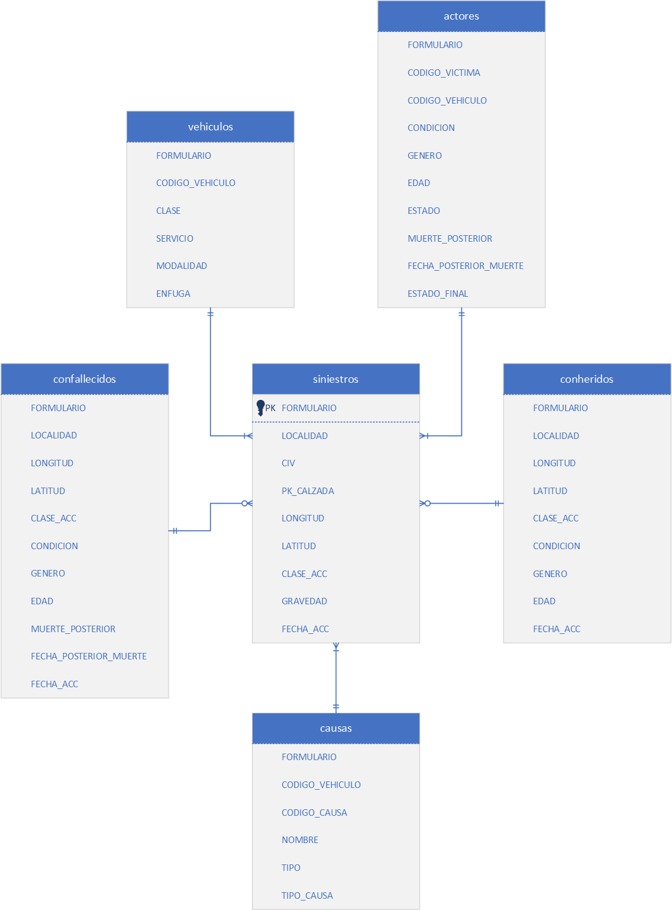

# Data model

Figure 1 below shows an overview of the model that captures the structure of the data elements stored in the local postgres database.

	

<b>Figure 1.</b> Data model of traffic accident data using the Crow's Foot notation.

A detailed data documentation is presented next.

## siniestros

Main table with basic information related to an accident.

* FORMULARIO (string): Code of the form where the basic information  about the accident was collected. It uniquely identifies the accident.
* LOCALIDAD (string): Borough where the accident occurred.
* CIV (int): Road identification code. Allows relating road information with accident information.
* PK_CALZADA (int): Roadway identification code. Allows identifying a roadway within a road.
* LONGITUD (double): Longitude coordinate of the accident location.
* LATITUD (double): Latitude coordinate of the accident location.
* CLASE_ACC (string): Type of accident (ATROPELLO: run over, AUTOLESION: a moving vehicle collides with a stationary vehicle or object, CAIDA DE OCUPANTE: occupant fall, CHOQUE: collision between moving vehicles, INCENDIO: fire, VOLCAMIENTO: overturn, and OTRO: other).
* GRAVEDAD (string): Severity of the accident (SOLO DANOS: minor accident, CON HERIDOS: injured people, and CON MUERTOS: killed people).
* FECHA_ACC (date): Date when the accident occurred (yyyy-mm-dd).
* ANO_OCURRENCIA_ACC (int): Year when the accident occurred.
* MES_OCURRENCIA_ACC (string): Month when the accident occurred.
* MES_NRO_OCURRENCIA_ACC (int): Month when the accident occurred (1 = Jan, 2 Feb, and so on).
* DIA_OCURRENCIA_ACC (string): Day of the week when the accident occurred.
* DIA_NRO_OCURRENCIA_ACC (int): Day of the week when the accident occurred (1 = Mon, 2 = Tue, and so on).
* DIA_MES_OCURRENCIA_ACC (int): Day of the month when the accident occurred. 
* HORA_OCURRENCIA_ACC (int): Time of day when the accident occurred.

## conheridos

Table with information related to people injured in an accident.

* FORMULARIO (string): Code of the form where the basic information  about the accident was collected. It uniquely identifies the accident.
* LOCALIDAD (string): Borough where the accident occurred.
* LONGITUD (double): Longitude coordinate of the accident location.
* LATITUD (double): Latitude coordinate of the accident location.
* CLASE_ACC (string): Type of accident (ATROPELLO: run over, AUTOLESION: a moving vehicle collides with a stationary vehicle or object, CAIDA DE OCUPANTE: occupant fall, CHOQUE: collision between moving vehicles, INCENDIO: fire, VOLCAMIENTO: overturn, and OTRO: other).
* CONDICION (string): Type of road actor involved in the accident (CICLISTA: cyclist, CONDUCTOR: driver, MOTOCICLISTA: motorcyclist, PASAJERO: passenger, and PEATON: pedestrian).
* GENERO (string): Gender of the road actor (FEMENINO: female, MASCULINO: male, and SIN INFORMACION: no info available).
* EDAD (int): Age of the road actor.
* FECHA_ACC (date): Date when the accident occurred (yyyy-mm-dd).
* ANO_OCURRENCIA_ACC (int): Year when the accident occurred.
* MES_OCURRENCIA_ACC (string): Month when the accident occurred.
* MES_NRO_OCURRENCIA_ACC (int): Month when the accident occurred (1 = Jan, 2 Feb, and so on).
* DIA_OCURRENCIA_ACC (string): Day of the week when the accident occurred.
* DIA_NRO_OCURRENCIA_ACC (int): Day of the week when the accident occurred (1 = Mon, 2 = Tue, and so on).
* DIA_MES_OCURRENCIA_ACC (int): Day of the month when the accident occurred. 
* HORA_OCURRENCIA_ACC (int): Time of day when the accident occurred.

## confallecidos

Table with information related to people killed in an accident.

* FORMULARIO (string): Code of the form where the basic information  about the accident was collected. It uniquely identifies the accident.
* LOCALIDAD (string): Borough where the accident occurred.
* LONGITUD (double): Longitude coordinate of the accident location.
* LATITUD (double): Latitude coordinate of the accident location.
* CLASE_ACC (string): Type of accident (ATROPELLO: run over, AUTOLESION: a moving vehicle collides with a stationary vehicle or object, CAIDA DE OCUPANTE: occupant fall, CHOQUE: collision between moving vehicles, INCENDIO: fire, VOLCAMIENTO: overturn, and OTRO: other).
* CONDICION (string): Type of road actor involved in the accident (CICLISTA: cyclist, CONDUCTOR: driver, MOTOCICLISTA: motorcyclist, PASAJERO: passenger, and PEATON: pedestrian).
* GENERO (string): Gender of the road actor (FEMENINO: female, MASCULINO: male, and SIN INFORMACION: no info available).
* EDAD (int): Age of the road actor.
* MUERTE_POSTERIOR (string): Captures whether the road actor died at a date following the accident (S) or not (N). For people killed in the accident, this field cannot be S and could be either N or null.
* FECHA_POSTERIOR_MUERTE (unix time): Date when the road actor passed away if she died at a date following the accident.
* FECHA_ACC (date): Date when the accident occurred (yyyy-mm-dd).
* ANO_OCURRENCIA_ACC (int): Year when the accident occurred.
* MES_OCURRENCIA_ACC (string): Month when the accident occurred.
* MES_NRO_OCURRENCIA_ACC (int): Month when the accident occurred (1 = Jan, 2 Feb, and so on).
* DIA_OCURRENCIA_ACC (string): Day of the week when the accident occurred.
* DIA_NRO_OCURRENCIA_ACC (int): Day of the week when the accident occurred (1 = Mon, 2 = Tue, and so on).
* DIA_MES_OCURRENCIA_ACC (int): Day of the month when the accident occurred. 
* HORA_OCURRENCIA_ACC (int): Time of day when the accident occurred.

## vehiculos

Table with information related to the vehicles involved in an accident.

* FORMULARIO (string): Code of the form where the basic information  about the accident was collected. It uniquely identifies the accident.
* CODIGO_VEHICULO (int): Number that identifies a vehicle involved in the accident.
* CLASE (string): Type of vehicle involved in the accident from 28 available categories, including motorcycle.
* SERVICIO (string): Type of service of a vehicle involved in the accident (DIPLOMATICO: diplomatic service, OFICIAL: government service, PARTICULAR: private vehicle, PUBLICO: public service, and SIN INFORMACION: no info available).
* MODALIDAD (string): For PUBLICO vehicles, it captures the type of passenger and/or cargo service a vehicle provides from 12 available categories.
* ENFUGA (string): Captures whether it was a hit-and-run vehicle (Y) or not (N).

## actores

Table with information related to the people involved in an accident.

* FORMULARIO (string): Code of the form where the basic information  about the accident was collected. It uniquely identifies the accident.
* CODIGO_VICTIMA (int): Number that identifies a road actor involved in the accident.
* CODIGO_VEHICULO (int): Number that identifies a vehicle involved in the accident.
* CONDICION (string): Type of road actor involved in the accident (CICLISTA: cyclist, CONDUCTOR: driver, MOTOCICLISTA: motorcyclist, PASAJERO: passenger, and PEATON: pedestrian).
* GENERO (string): Gender of the road actor (FEMENINO: female, MASCULINO: male, and SIN INFORMACION: no info available).
* EDAD (int): Age of the road actor.
* ESTADO (string): Captures whether the road actor was uninjured (ILESO), injured (HERIDO) or killed (MUERTO) as a result of the accident.
* MUERTE_POSTERIOR (string): Captures whether the road actor died at a date following the accident (S) or not (N). For people killed in the accident, this field cannot be S and could be either N or null. For uninjured and injured people, if they didn’t die at a date following the accident, this field could be either N or null.
* FECHA_POSTERIOR_MUERTE (unix time): Date when the road actor passed away if she died at a date following the accident.
* ESTADO_FINAL (string): Captures whether the road actor was killed regardless of whether she died in the accident or at a date following the accident (MUERTO), injured (HERIDO) or uninjured (ILESO). This attribute tries to address some inconsistencies found when looking at the values from ESTADO and MUERTE_POSTERIOR. 

## causas

Table with information related to the causes of an accident.

* FORMULARIO (string): Code of the form where the basic information  about the accident was collected. It uniquely identifies the accident.
* CODIGO_VEHICULO (int): Number that identifies a vehicle involved in the accident.
* CODIGO_CAUSA (string): Cause of the accident of each vehicle involved in the accident from 108 available categories.
* NOMBRE (string): Name of CODIGO_CAUSA.
* TIPO (string): For each CODIGO_CAUSA, it captures whether the cause was associated with a cyclist/motorcyclist (CE), a driver (CG), a passenger (PA), a pedestrian (PE) or the road (VI).
* TIPO_CAUSA (string): Name of TIPO.